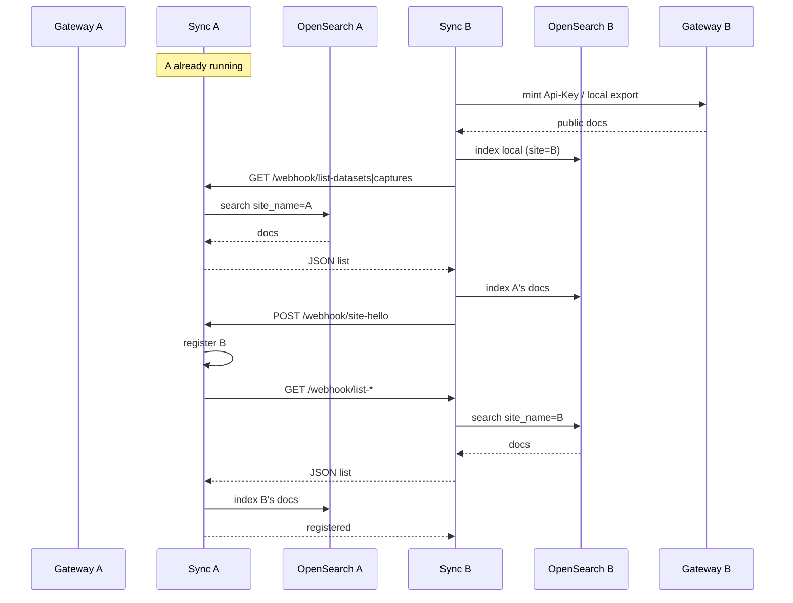

# Federation bootstrap flow

How a sync service fills local `fed-*` OpenSearch on startup, and how an
already-running peer backfills when a new site says hello.

Entry point: `run_bootstrap()` in `sds_federation/services/bootstrap.py`, called
from app lifespan in `sds_federation/main.py` (unless
`FEDERATION_BOOTSTRAP_ON_START=false`).

```text
run_bootstrap()
  1. ensure_local_export_api_key()     # mint/cache Api-Key for local gateway
  2. bootstrap_local_site()            # local gateway → Postgres export → OS
  3. bootstrap_all_peers()             # each peer sync → list-* → OS
  4. register_with_peers()             # POST site-hello to each peer
```

After that, the Redis subscriber starts. Ongoing changes use
`POST /webhook/{dataset|capture}-updated`, not bootstrap.

---

## 1. Local export (this site’s gateway)

**Purpose:** Index this site’s public datasets/captures that already exist in
Postgres (signals only cover future saves).

| | |
|---|---|
| Function | `bootstrap_local_site` → `bootstrap_gateway_exports` |
| Source | Local gateway HTTP |
| Auth | `Api-Key` from `FEDERATION_SYNC_SERVER_API_KEY` or mint via `FEDERATION_SYNC_DRF_TOKEN` |
| URLs | `{gateway_api_base}/federation/export/datasets/` and `.../captures/` |
| Data | Compiled from gateway DB (`public_*_queryset` / federation serializers) |
| Sink | Local OpenSearch `fed-datasets` / `fed-captures` via `FederatedAssetIndexer` |

```text
Sync A                         Gateway A                      OpenSearch A
  |                                |                               |
  |-- GET /federation/export/... ->|                               |
  |   Authorization: Api-Key       |                               |
  |<- JSON list of docs -----------|                               |
  |-- index each doc (site_name=A) ------------------------------->|
```

Only used for **self**. Remote peers are never pulled through their gateways.

---

## 2. Peer export / list (other sites’ sync)

**Purpose:** Copy peer-owned historical metadata into this site’s OpenSearch
without needing a remote gateway API key.

| | |
|---|---|
| Function | `bootstrap_all_peers` → `bootstrap_peer_sync_list` |
| Source | Peer sync HTTP (reads that peer’s local `fed-*`) |
| Auth | None today (same trust model as other peer webhooks; mTLS later) |
| URLs | `{peer.sync_service_url}/api/v1/webhook/list-datasets/` and `.../list-captures/` |
| Data | Docs in peer OpenSearch with `site_name == peer.site.name` |
| Sink | Local OpenSearch via `FederatedAssetIndexer` |

Peer handler: `GET /webhook/list-datasets|captures/` in
`sds_federation/routes/webhooks.py` → `alist_federated_assets_for_site`.

```text
Sync A                         Sync B                         OpenSearch B
  |                                |                               |
  |-- GET /api/v1/webhook/list-* ->|                               |
  |                                |-- search fed-* (site=B) ----->|
  |                                |<- hits -----------------------|
  |<- JSON list -------------------|                               |
  |-- index into OpenSearch A ------------------------------------>|
```

`site_name` on each doc must equal the peer’s configured `name` or the doc is
skipped.

---

## 3. Hello backfill (running peer learns about a newcomer)

**Purpose:** When site B starts and sends `site-hello` to already-running A, A
must pull B’s existing catalog. Startup bootstrap on A alone is not enough if A
was already up.

| | |
|---|---|
| Trigger | `POST /webhook/site-hello` on the **receiver** |
| After register | `backfill_peer_on_hello` → same `bootstrap_peer_sync_list` as (2) |
| Pull target | Helloing peer’s `sync_service_url` list endpoints |
| Sink | Receiver’s OpenSearch |

```text
Sync B (new)                   Sync A (already up)
  |                                |
  |-- POST /webhook/site-hello --->|
  |                                |-- PeerRegistry.register(B)
  |                                |-- GET B /webhook/list-*  (backfill)
  |                                |-- index B’s docs locally
  |<- { status: registered } ------|
```

Symmetric case: B’s own `run_bootstrap` already pulled A in step (2) before
sending hello.

---

## Comparison

| | Local export | Peer list (startup) | Hello backfill |
|---|---|---|---|
| When | Sync start | Sync start (per peer) | On receiving `site-hello` |
| From | Local **gateway** | Peer **sync** | Peer **sync** |
| Auth | FederationSync Api-Key | Peer channel (no Api-Key) | Same as peer list |
| Reads | Postgres (compiled) | Peer `fed-*` OpenSearch | Peer `fed-*` OpenSearch |
| Writes | Local `fed-*` | Local `fed-*` | Local `fed-*` |
| Code | `bootstrap_local_site` | `bootstrap_all_peers` | `backfill_peer_on_hello` |

---

## End-to-end (two sites)



---

## Related ongoing path (not bootstrap)

After bootstrap, local gateway saves publish Redis → sync loads local `fed-*` →
`POST /webhook/{dataset|capture}-updated` to peers → peer indexes one doc.
That path does not replace historical pull; it only covers new changes.
