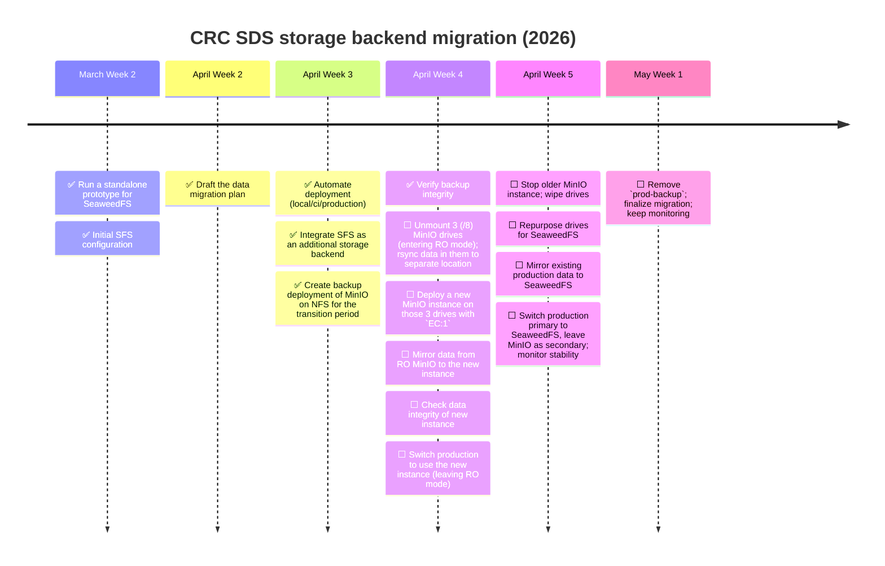

# Migration: MinIO → SeaweedFS

Runbook for migrating existing object storage from MinIO to SeaweedFS (SFS).

For **new deployments**, run `./scripts/deploy.sh <env>` from the `gateway/` directory —
SeaweedFS setup is fully automated. This document covers data migration from a running
MinIO instance and production-specific configuration.

+ [Migration: MinIO → SeaweedFS](#migration-minio--seaweedfs)
    + [Diagram](#diagram)
    + [Prerequisites](#prerequisites)
    + [1. Start both stacks](#1-start-both-stacks)
    + [2. Configure `mc` aliases](#2-configure-mc-aliases)
    + [3. Migrate data](#3-migrate-data)
    + [4. Verify migration](#4-verify-migration)
    + [5. Switch the application to SFS](#5-switch-the-application-to-sfs)
    + [6. Tear down MinIO](#6-tear-down-minio)
    + [Production customizations](#production-customizations)
        + [Multi-disk storage](#multi-disk-storage)
        + [Strong credentials](#strong-credentials)
        + [Production checklist](#production-checklist)
    + [Rollback](#rollback)

---

## Diagram



+ March Week 2
    + [x] Run a standalone prototype for SeaweedFS
    + [x] Initial SFS configuration
+ April Week 2
    + [x] Draft the data migration plan
+ April Week 3
    + [x] Automate deployment (local/ci/production)
    + [x] Integrate SFS as an additional storage backend
    + [x] Create backup deployment of MinIO on NFS for the transition period
+ April Week 4
    + [x] Verify backup integrity
    + [ ] Unmount 3 (/8) MinIO drives (entering RO mode); rsync data in them to separate location
    + [ ] Deploy a new MinIO instance on those 3 drives with `EC:1`
    + [ ] Mirror data from RO MinIO to the new instance
    + [ ] Check data integrity of new instance
    + [ ] Switch production to use the new instance (leaving RO mode)
+ April Week 5
    + [ ] Stop older MinIO instance; wipe drives
    + [ ] Repurpose drives for SeaweedFS
    + [ ] Mirror existing production data to SeaweedFS
    + [ ] Switch production primary to SeaweedFS, leave MinIO as secondary; monitor stability
+ May Week 1
    + [ ] Remove `prod-backup`; finalize migration; keep monitoring

---

## Prerequisites

| Tool                    | Purpose                      |
| ----------------------- | ---------------------------- |
| `just` command runner   | orchestrating commands       |
| `mc` (MinIO Client)     | data transfer + verification |
| Docker / Docker Compose | running both stacks          |

+ Install `mc` from <https://min.io/docs/minio/linux/reference/minio-mc.html>.
+ Install `just` from <https://github.com/casey/just#installation>.

---

## 1. Start both stacks

```bash
# from gateway/
just up

# from seaweedfs/ — starts all services, configures credentials, creates the bucket
just deploy local
```

Verify both are healthy:

```bash
just dc ps                              # gateway services + minio
cd ../seaweedfs && just dc ps           # seaweedfs services
curl -s http://localhost:8333/healthz   # SFS S3 endpoint: expected empty 200
```

---

## 2. Configure `mc` aliases

```bash
# read credentials from env files
SECONDARY_USER=$(grep SECONDARY_ROOT_USER .envs/local/storage.env | cut -d= -f2)
SECONDARY_PASS=$(grep SECONDARY_ROOT_PASSWORD .envs/local/storage.env | cut -d= -f2)
PRIMARY_KEY=$(grep PRIMARY_ACCESS_KEY_ID .envs/local/storage.env | cut -d= -f2)
PRIMARY_SECRET=$(grep PRIMARY_SECRET_ACCESS_KEY .envs/local/storage.env | cut -d= -f2)

mc alias set minio http://localhost:9000 "${SECONDARY_USER}" "${SECONDARY_PASS}"
mc alias set sfs   http://localhost:8333 "${PRIMARY_KEY}"    "${PRIMARY_SECRET}"
```

Verify:

```bash
mc ls minio/spectrumx
mc ls sfs/spectrumx
```

---

## 3. Migrate data

```bash
# dry run first
mc mirror --preserve --dry-run minio/spectrumx sfs/spectrumx

# run the actual migration
mc mirror --preserve minio/spectrumx sfs/spectrumx
```

---

## 4. Verify migration

```bash
echo "MinIO:     $(mc ls --recursive minio/spectrumx | wc -l) objects"
echo "SeaweedFS: $(mc ls --recursive sfs/spectrumx   | wc -l) objects"

# full diff — no output means migration is complete
mc diff minio/spectrumx sfs/spectrumx
```

---

## 5. Switch the application to SFS

The compose files already reference `storage.env` for both backends. Restart the
gateway to confirm:

```bash
just down && just up
curl -s http://localhost:8000/api/v1/files/ | head
```

---

## 6. Tear down MinIO

Once migration is verified:

1. Stop MinIO: `just dc stop minio`
2. Remove `storage.env` entries from `env_file` lists in the compose file (lines marked `# legacy`).
3. Remove the `minio:` service block.
4. Remove the `sds-gateway-<env>-minio-net` network and `sds-gateway-<env>-minio-files` volume.
5. Restart: `just down && just up`

Delete the volume (irreversible — confirm backups exist first):

```bash
docker volume rm sds-gateway-local-minio-files
```

---

## Production customizations

### Multi-disk storage

The default production compose uses named Docker volumes. For large-scale deployments,
replace volume mounts with bind mounts to dedicated disks in a `compose.override.yaml`:

```yaml
services:
    sds-gateway-prod-sfs-volume:
        command: |
            volume
                -dir="/data1/volumes,/data2/volumes,/data3/volumes"
                -ip.bind=0.0.0.0
                -ip=sds-gateway-prod-sfs-volume
                -master="sds-gateway-prod-sfs-master:9333"
                -max=0
                -port=8080
        volumes:
            - /mnt/disk1/seaweedfs:/data1
            - /mnt/disk2/seaweedfs:/data2
            - /mnt/disk3/seaweedfs:/data3
```

### Strong credentials

Generate production credentials and keep both files in sync:

```bash
ACCESS_KEY=$(openssl rand -hex 16)
SECRET_KEY=$(openssl rand -base64 32 | tr -d '=+/')

ACCESS_KEY=$(grep PRIMARY_ACCESS_KEY_ID .envs/local/storage.env | cut -d= -f2)
SECRET_KEY=$(grep PRIMARY_SECRET_ACCESS_KEY .envs/local/storage.env | cut -d= -f2)

sed -i "s/^PRIMARY_ACCESS_KEY_ID=.*/PRIMARY_ACCESS_KEY_ID=${ACCESS_KEY}/" \
    gateway/.envs/production/storage.env \
    seaweedfs/.envs/production/sfs.env

sed -i "s/^PRIMARY_SECRET_ACCESS_KEY=.*/PRIMARY_SECRET_ACCESS_KEY=${SECRET_KEY}/" \
    gateway/.envs/production/storage.env \
    seaweedfs/.envs/production/sfs.env
```

### Production checklist

1. Add the server hostname to `seaweedfs/scripts/prod-hostnames.env` and
   `gateway/scripts/prod-hostnames.env` — deploy scripts validate this.

2. Confirm `seaweedfs/.envs/production/sfs.env` and `gateway/.envs/production/storage.env`
   have matching non-empty credentials.

3. The `sds-network-prod` Docker network must exist (the deploy script creates it
   automatically unless `--skip-network` is passed).

4. If using named volumes, confirm the Docker storage backend is on production-grade
   disk(s), or use bind mounts as shown above.

5. Schedule the data migration step during a maintenance window to avoid concurrent
   writes during the `mc mirror` run.

---

## Rollback

Replace `storage.prod.env` with `storage.env` in the `env_file` lists of the compose file, then
restart the gateway.
